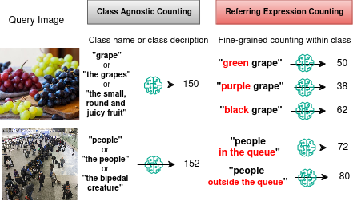

# Referring Expression Counting

Official implementation of CVPR 2024 paper 'Referring Expression Counting'.



## Dataset download
Annotations for the REC-8K dataset are available [here](https://drive.google.com/file/d/1K3E7fd3D12L3-AlBhmOGRD73-KaOWYkK/view?usp=sharing).
Unzip the downloaded anno.zip file under the project root folder.


REC-8K images are selected from below datasets and partially collected from the internet for diverse scenes and object attributes.
Due to the restriction of the original dataset license, we provide the original download links for the datasets.
| Data Source  | Link | Remark |
| -------- | -------- | -------- |
|Crowd Surveillance [1]| [download](https://drive.google.com/file/d/1QOv1jdOkfVYj6kw1lVZjQJo13V_23kGK/view?usp=sharing) |  |
|mall [2]  | [download](https://personal.ie.cuhk.edu.hk/~ccloy/downloads_mall_dataset.html) |  |
|DETRAC [3] | [download](https://wayback.archive-it.org/org-652/20231112212640/https://detrac-db.rit.albany.edu/download) |  |
|FSC147 [4] | [download](https://github.com/cvlab-stonybrook/LearningToCountEverything/tree/master?tab=readme-ov-file#dataset-download)|  |
|CARPK [5] | [download](https://lafi.github.io/LPN/) |  |
|NWPU [6] | [download](https://gjy3035.github.io/NWPU-Crowd-Sample-Code/) | unzip part1-5 into one NWPU/images folder |
|internet | [download](https://drive.google.com/file/d/1eQ0T6B5Qev81FEU3lMUzUeegNkiWTQHq/view?usp=sharing)
|VisDrone [7] | [download](https://github.com/VisDrone/VisDrone-Dataset?tab=readme-ov-file) | Task 5: Crowd Counting |
|JHU-CROWD++ [8] | [download](http://www.crowd-counting.com/#download) |  |

After downloading the datasets, rearrange the dataset folder structure as below and run the `data_preprocess.py` script to extract & rename the images for the REC-8K dataset.
The resulting REC-8K images will be saved in the '<DATA_ROOT>/rec-8k' folder.

```
- <DATA_ROOT>/
    - Crowd Surveillance/images_train/images/train
    - mall_dataset/frames
    - DETRAC/DETRAC-train-data/Insight-MVT_Annotation_Train
    - FSC147_384_V2/images_384_VarV2
    - CARPK_devkit/data/Images
    - NWPU/images
    - internet
    - VisDrone2020-CC/sequences
    - jhu_crowd_v2.0/test/images
```

## Pretrained model
Download the pretrained GroundingDINO model [9] under the project root folder.

```
wget https://github.com/IDEA-Research/GroundingDINO/releases/download/v0.1.0-alpha/groundingdino_swint_ogc.pth
```

## Training and evaluation
To train and evaluate the model, run the following command.
```
<!-- build venv -->
python -m venv venv
source venv/bin/activate
pip install -r requirements.txt
<!-- train -->
python train_test.py

```

## Acknowledgement
We thank the authors of the following papers [1-8] for the datasets.

This work is inspired by the GroundingDINO paper [9]. We thank the authors for the model implementation and the pretrained model.

<!-- ### References -->

1. Zhaoyi Yan, Yuchen Yuan, Wangmeng Zuo, Xiao Tan, Yezhen Wang, Shilei Wen, and Errui Ding. Perspective-guided convolution networks for crowd counting. 2019
2. Ke Chen, Shaogang Gong, Tao Xiang, and Chen Change Loy. Cumulative attribute space for age and crowd density estimation. In 2013 IEEE Conference on Computer Vision and Pattern Recognition, pages 2467–2474, 2013.
3. Longyin Wen, Dawei Du, Zhaowei Cai, Zhen Lei, Ming Ching Chang, Honggang Qi, Jongwoo Lim, Ming-Hsuan Yang, and Siwei Lyu. UA-DETRAC: A new benchmark and protocol for multi-object detection and tracking. Computer Vision and Image Understanding, 2020.
4. Viresh Ranjan, Udbhav Sharma, Thu Nguyen, and Minh Hoai. Learning to count everything. In Proceedings of the IEEE/CVF Conference on Computer Vision and Pattern Recognition (CVPR), pages 3394–3403, 2021.
5. Meng-Ru Hsieh, Yen-Liang Lin, and Winston H. Hsu. Drone-based object counting by spatially regularized regional proposal networks. In The IEEE International Conference on Computer Vision (ICCV). IEEE, 2017.
6. Qi Wang, Junyu Gao, Wei Lin, and Xuelong Li. Nwpucrowd: A large-scale benchmark for crowd counting and localization. IEEE Transactions on Pattern Analysis and Machine Intelligence, 2020.
7. Pengfei Zhu, Longyin Wen, Dawei Du, Xiao Bian, Heng Fan, Qinghua Hu, and Haibin Ling. Detection and tracking meet drones challenge. IEEE Transactions on Pattern Analysis and Machine Intelligence, 44(11):7380–7399, 2021.
8. Vishwanath A Sindagi, Rajeev Yasarla, and Vishal M Patel. Jhu-crowd++: Large-scale crowd counting dataset and a benchmark method. Technical Report, 2020.
9. Shilong Liu, Zhaoyang Zeng, Tianhe Ren, Feng Li, Hao Zhang, Jie Yang, Chunyuan Li, Jianwei Yang, Hang Su, Jun Zhu, et al. Grounding dino: Marrying dino with grounded pre-training for open-set object detection. arXiv preprint arXiv:2303.05499, 2023.

## Citation
If you use this code, please cite our paper.
```
@InProceedings{Dai_2024_CVPR,
    author    = {Dai, Siyang and Liu, Jun and Cheung, Ngai-Man},
    title     = {Referring Expression Counting},
    booktitle = {Proceedings of the IEEE/CVF Conference on Computer Vision and Pattern Recognition (CVPR)},
    month     = {June},
    year      = {2024},
    pages     = {16985-16995}
}
```
